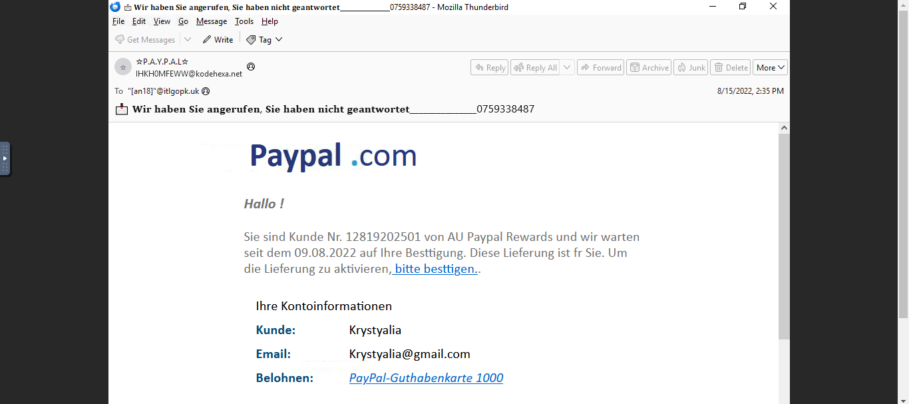
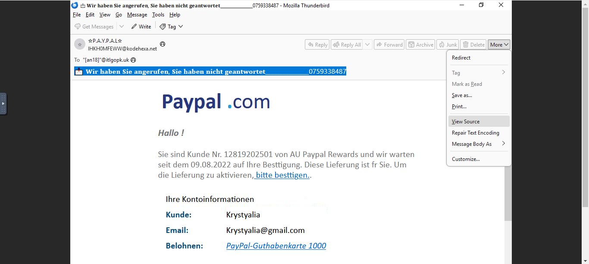

# Phishing Email Analysis Documentation

## Overview
This document details the process of analyzing a suspicious email that was part of the LETSDEFEND.IO phishing email challenge. The email, which appeared to be from PayPal, was written in German and raised suspicions. The goal was to thoroughly analyze the email, identify potential threats, and answer key questions about the phishing attempt.

## Email Presentation and Initial Observations

### Screenshot: Email Presentation


Upon receiving the email, I noticed a few immediate red flags:
- The email was written in German, which is unusual given my typical communication language.
- The email claimed to be from PayPal, a well-known brand, but the presentation felt off.

### Navigating to the Email Source
To investigate further, I accessed the source of the email by selecting the option to view the email headers and raw content. This allowed me to analyze the underlying details of the email that aren’t visible in the normal email view.

### Screenshot: Navigating to Email Source


## Full Email Source
```
Delivered-To: krystyalia@gmail.com
Received: by 2002:a59:ce05:0:b0:2d3:3de5:67a9 with SMTP id l5csp1310935vqx;
        Mon, 15 Aug 2022 07:35:02 -0700 (PDT)
X-Google-Smtp-Source: AA6agR5km6ywOzoBtEq9clYbBp8qJUgwZjl3vP31rmyn3ReGCZe7C1UBuWHBbIZLS4vvQF7qIUqB
X-Received: by 2002:a92:c543:0:b0:2e4:c514:4ad8 with SMTP id a3-20020a92c543000000b002e4c5144ad8mr5344852ilj.301.1660574102289;
        Mon, 15 Aug 2022 07:35:02 -0700 (PDT)
ARC-Seal: i=1; a=rsa-sha256; t=1660574102; cv=none;
        d=google.com; s=arc-20160816;
        b=v0vRI/Pfq0mG8+kEolqxZIG0U7TAEObvlwr8ILnGJSKrCr+0gwGjNTLTuLDOKuQSYL
         +0KATfrRyeS+S4J4EaV+9n/ctMKNKFGu4213iyMaCSuzaF7XBEwFe0scYp4r6QbeFKjp
         DVgAnm8CQubLm9+DOk1jlnLmoqfDRIUB+tC3QS8VWVOOtNo1jF7lPhJTV5WoSW3uHDhL
         cNHj70daaMitn5LQwqY3u3h/XhQR9f0pLWGPqeaM/8OSAyaU8aIlxpNMVL7EiltQgsew
         6o7lgKjzOkn+g+5jEWGPRjWFjwJTmudTN4yTHOQhB5hFRGbrvv0m0FNN/lR9HuqpeKH3
         7f8g==
ARC-Message-Signature: i=1; a=rsa-sha256; c=relaxed/relaxed; d=google.com; s=arc-20160816;
        h=feedback-id:message-id:to:subject:envelope-to:list-unsubscribe:from
         :date;
        bh=RBOWoaMMpae2XSW5fIY8AMWesjkkUGv9NVPbU5akMiw=;
        b=qEx4Dby+KeEbwFfEkyTOLalZdP2Bi/1x++tzApl5zqJPEO+/yhr49+kFUAOLs6YejZ
         5GVU8PA4yOTHHBDuLmYr6tGRNNdbohZIT7G6rz+hV1uU8bNmoUTzVXoTzWUSZKUappHH
         WnfmvEJzQvlPvdPPgwA2/5a4HKxeCLX+Pa/YJ0wUfeXrDwHBDiHmG2hpG2h2n07BkWYk
         CVhDnFFhQ8tDO6dS371kOBeYBcseystA3+1SoBs6M6qZbEPPXzNXkyFqN6NuoeCmNn3d
         moGUHjeXaGD3W1kY+qjvUywVULouHPSK0F578CTgg1/DSdm7UGYnJyMYlyrbA9EBXa5H
         Mm1Q==
ARC-Authentication-Results: i=1; mx.google.com;
       spf=pass (google.com: domain of bounce@rjttznyzjjzydnillquh.designclub.uk.com designates 134.195.196.43 as permitted sender) smtp.mailfrom=bounce@rjttznyzjjzydnillquh.designclub.uk.com
Return-Path: <bounce@rjttznyzjjzydnillquh.designclub.uk.com>
Received: from foresthillrestaurant.com (capchrist.org. [134.195.196.43])
        by mx.google.com with ESMTP id v19-20020a056638251300b00343383b93c1si6702219jat.13.2022.08.15.07.35.01
        for <krystyalia@gmail.com>;
        Mon, 15 Aug 2022 07:35:02 -0700 (PDT)
Received-SPF: pass (google.com: domain of bounce@rjttznyzjjzydnillquh.designclub.uk.com designates 134.195.196.43 as permitted sender) client-ip=134.195.196.43;
Authentication-Results: mx.google.com;
       spf=pass (google.com: domain of bounce@rjttznyzjjzydnillquh.designclub.uk.com designates 134.195.196.43 as permitted sender) smtp.mailfrom=bounce@rjttznyzjjzydnillquh.designclub.uk.com
Received: from efianalytics.com (efianalytics.com. 216.244.76.116)
Date: Mon, 15 Aug 2022 10:35:01 -0400 (EDT)
From:  "?P.A.Y.P.A.L?"  <IHKH0MFEWW@kodehexa.net>
X-EMMAIL: Marrybenh@kodehexa.net
List-Unsubscribe: <mailto:<6kb5309jhvfamn7t0kt-iyct34ecfud7rfs3owh5d355dzxhy5.ljdg2j.quk3tu.9@unsub-sj.mktomail.com>
Envelope-To: <krystyalia@gmail.com>
Subject:  ?? ?????? ?????????? ?????? ??????????????????, ?????? ?????????? ?????????? ??????????????????????_______________0759338487
To: <[an18]@itlgopk.uk>
Message-Id: <-@vevida.net>
X-MarketoID: vKD-Gha-mqeegooa:0:jJKk4V:9:oB3EVd:besLKX8VE
Feedback-ID: 1.us-east-1.psHyoMfnH8hkuQnF72JGzzQK1By9IkayShm7uIk1GIc=:AmazonSES
X-PVIQ: mkto-RdMCgBVWW-NB6yqY-hZCeCx-FdLezk
Content-Type: multipart/report; boundary="000000000000SGCNuB7Qm6umj710elBSQB"; report-type=delivery-status

--000000000000SGCNuB7Qm6umj710elBSQB
Content-Type: multipart/related; boundary="000000000000B0MNRUNyYR84HR9a"

--000000000000B0MNRUNyYR84HR9a
Content-Type: multipart/alternative; boundary="000000000000B0MNRUNyYR84HR9b"

--000000000000B0MNRUNyYR84HR9b
Content-Type: text/plain; charset="UTF-8"
Content-Transfer-Encoding: quoted-printable

Top Stories of the Day: Mon, 15 Aug 2022 10:35:01 -0400 (EDT)

384382299382446281
-----
ggtwfouyfnynwgqololxakgwudhtkvnhogafpjgctzkzazptiapkkouipkgecsgsspfqmxxptgurwoffnswmljbnzyectoehitafxvbvrlnymiftcboectjvqwjahugddiojegjxtrjnkqqljyoklsyzljbomvqzxdraozqwudeyrbksoxamufytlwviddnaxxkupiauolcpiq

If you believe this has been sent to you in error, please safely unsubscrib=
e

--000000000000B0MNRUNyYR84HR9b
Content-Type: text/html; charset="UTF-8"
Content-Transfer-Encoding: 8bit+


<!DOCTYPE HTML PUBLIC "-//W3C//DTD HTML 4.01//EN" "www.w3.org/TR/html4/strict.dtd">
<html>
<head>
<meta http-equiv="Content-Type" content="text/html; charset=windows-1252"><title>&#87;&#97;&#108;&#109;&#97;&#114;&#116;&#65;&#109;&#97;&#122;&#111;&#46;&#99;&#111;&#109; </title>
</head>
<body>

			<div style="font-family:Calibri,Helvetica,Arial,sans-serif">
				<table width="564" cellspacing="0" cellpadding="0" border="0" align="center">
					<tr>
						<td bgcolor="#FFFFFF">
						<table width="600" cellspacing="0" cellpadding="8" border="0">
							<tr>
								<td bgcolor="#FFFFFF" >
									<b><font color="#27377C"><font size="7">Paypal </font></font><font color="#24A0D5" size="7">.</font></b><font size="7" color="#27377C">&#99;&#111;&#109;</font></td>
							</tr>
						</table>
						</td>
					</tr>
					<tr>
						<td valign="top" height="21" bgcolor="#FFFFFF">
								&nbsp;</td>
					</tr>
					<tr>
						<td valign="top" height="137" bgcolor="#FFFFFF">
								<font size="4" face="Calibri, Helvetica, Arial, sans-serif;" color="#737373">
								<strong><em>
								<span style="font-size:22px" >
								Hallo !</span></em></strong><br>
								<br>Sie sind Kunde Nr. 12819202501 von AU Paypal Rewards und wir warten seit dem 09.08.2022 auf Ihre Besttigung. Diese Lieferung ist fr Sie. Um die Lieferung zu aktivieren,<a href="https://storage.googleapis.com/hqyoqzatqthj/aemmfcylvxeo.html#QORHNZC44FT4.QORHNZC44FT4?dYCTywccxr3jcxxrmcdcKBdmc5D6qfcJVcbbb4M">
							bitte besttigen.</a>.</font></td>
					</tr>
					<tr>
						<td valign="top" height="164" bgcolor="#FFFFFF">
						<table width="600" cellspacing="0" cellpadding="12" border="0">
							<tr>
								<td width="552" valign="top" bgcolor="#FFFFFF">
								<table width="389" cellspacing="0" cellpadding="6" border="0">
									<tr>
										<td colspan="2" bgcolor="#FFFFFF">
										<font size="4" face="Calibri, Helvetica, Arial, sans-serif;">
									Ihre Kontoinformationen
</strong></font></td>
									</tr>
									<tr>
										<td width="36%" bgcolor="#ffffff">
										<strong><style>9yjf8g7o9ty7n5ym5x5xqm5hurb8mop8</style>
										<font face="Calibri, Helvetica, Arial, sans-serif;" size="4" color="#084B76">
										Kunde</font></strong><font size="4" face="Calibri, Helvetica, Arial, sans-serif;" color="#084B76"><strong>:</strong></font></td>
										<td width="64%" bgcolor="#ffffff">
										<font size="4">Krystyalia</font></td>
									</tr>
									<tr>
										<td bgcolor="#FFFFFF">
										<font size="4" face="Calibri, Helvetica, Arial, sans-serif;" color="#084B76">
										<strong>&#69;&#109;&#97;&#105;&#108;:</strong></font></td>
										<td bgcolor="#FFFFFF">
										<font size="4">Krystyalia@gmail.com</font></td>
									</tr>
									<tr>
										<td bgcolor="#FFFFFF">
										<strong>
										<font face="Calibri, Helvetica, Arial, sans-serif;" size="4" color="#084B76">
										Belohnen</font></strong><font size="4" face="Calibri, Helvetica, Arial, sans-serif;" color="#084B76"><strong>:</strong></font></td>
										<td bgcolor="#FFFFFF">
										<i><font size="4"><a href="https://storage.googleapis.com/hqyoqzatqthj/aemmfcylvxeo.html#QORHNZC44FT4.QORHNZC44FT4?dYCTywccxr3jcxxrmcdcKBdmc5D6qfcJVcbbb4M">PayPal-Guthabenkarte 1000   </a></font></i></td>
									</tr>
									</table>
								</td>
							</tr>
						</table>
						</td>
					</tr>
				</table>
			</div>

<div style="font-family:Calibri,Helvetica,Arial,sans-serif">
	<table width="600" cellspacing="0" cellpadding="0" border="0" align="center">
		<tr>
			<td valign="top" bgcolor="#FFFFFF">
			<table width="600" cellspacing="0" cellpadding="12" border="0">
				<tr>
					<td width="290" valign="top" align="center">
					<table width="85%" cellpadding="16" border="0">
						<tr>
							<td style="border-radius:6px" bgcolor="#27377C" align="center">
							<strong>
							<a href="https://storage.googleapis.com/hqyoqzatqthj/aemmfcylvxeo.html#QORHNZC44FT4.QORHNZC44FT4?dYCTywccxr3jcxxrmcdcKBdmc5D6qfcJVcbbb4M">
							<font face="Verdana, Geneva, sans-serif" size="4" color="#FFFFFF">
							Setzen Sie die Lieferung fort</font></a></strong></td>
						</tr>
					</table>
					</td>
				</tr>
			</table>
			</td>
		</tr>
		<tr>
			<td valign="top">
			<table width="600" cellspacing="0" cellpadding="18" border="0">
				<tr>
					<td bgcolor="#FFFFFF">
					<hr>&nbsp;</td>
				</tr>
			</table>
			</td>
		</tr>
	</table>
</div>
     <center> <p style="text-align:center;font-family: 'Open Sans','Arial','Helvetica',sans-serif;font-size:13px;"><br><br> 

<a href="https://storage.googleapis.com/hqyoqzatqthj/aemmfcylvxeo.html#QORHNZC44FT4.QORHNZC44FT4?dYCTywdcxr3jcxxrmcdcKBdmc5D6qfcJVcbbb4M"> Abmelden </a><br><br>
</center>

     <center> <p style="text-align:center;font-family: 'Open Sans','Arial','Helvetica',sans-serif;font-size:13px;"><br><br> 
 <br>The advertiser does not manage your subscription.<br>
If you perfer not to receive further communication please unsubscribe<a href="https://storage.googleapis.com/hqyoqzatqthj/aemmfcylvxeo.html#QORHNZC44FT4.QORHNZC44FT4?dYCTywfcxr3jcxxrmcdcKBdmc5D6qfcJVcbbb4M"> here</a><br>Or write to: 34 N Franklin Ave Ste 687#2043, Pinedale, WY, 82941 <br>
</center>
 </body>
</html><table width="100%" cellpadding="0" cellspacing="0" border="0" style="">
  
--000000000000B0MNRUNyYR84HR9b--
--000000000000B0MNRUNyYR84HR9a--
--000000000000SGCNuB7Qm6umj710elBSQB--

```

## Summary of Email Sections

1. **Delivery Information:**
   - The email was delivered to `krystyalia@gmail.com` and passed through various SMTP servers, as indicated by the `Received` headers.
   - The presence of multiple hops is typical, but this can sometimes indicate spoofing when coupled with other suspicious elements.

2. **Authentication Information:**
   - The `ARC-Seal`, `ARC-Message-Signature`, and `ARC-Authentication-Results` indicate that the email attempted to authenticate itself using the ARC protocol.
   - The `spf=pass` indicates that the sending domain passed the SPF check, which can sometimes be a sign of legitimacy but is often spoofed in phishing attacks.

3. **Return Path:**
   - **Return Path:** `bounce@rjttznyzjjzydnillquh.designclub.uk.com`
   - The return path is a key indicator of phishing as it doesn’t match PayPal’s legitimate domain. This was one of the first signs that the email might be malicious.

4. **From and To Information:**
   - The email claims to be from `PayPal` but the actual email address `IHKH0MFEWW@kodehexa.net` is not associated with PayPal.
   - The email was sent to `krystyalia@gmail.com`, but the `To:` field in the headers indicates a potentially obfuscated recipient address.

5. **Email Body:**
   - The email body included both plain text and HTML versions. The HTML version tried to mimic PayPal’s branding, including a logo and links.

## Analyzing the Email for the Challenge Questions

### 1. **What is the return path of the email?**
   - **Return Path:** `bounce@rjttznyzjjzydnillquh.designclub.uk.com`
   - This was identified in the email headers and is suspicious due to the mismatch with PayPal’s legitimate domain.

### 2. **What is the domain name of the URL in this mail?**
   - **Domain Name:** `storage.googleapis.com`
   - The email contained a link pointing to `https://storage.googleapis.com`, a Google Cloud storage domain. Although Google Cloud is a legitimate service, it is often used by attackers to host malicious content.

### 3. **Is the domain mentioned in the previous question suspicious?**
   - **Is the Domain Suspicious?** Yes
   - Despite being a trusted domain, the context in which it was used (hosting a phishing page) makes it suspicious. A domain reputation check could confirm this suspicion.

### 4. **What is the body SHA-256 of the domain?**
   - **Body SHA-256 Hash:** `13945ecc33afee74ac7f72e1d5bb73050894356c4bf63d02a1a53e76830567f5`
   - I found this hash by navigating to VirusTotal, scanning the full domain (`storage.googleapis.com`), and checking the "Details" tab.

### 5. **Is this email a phishing email?**
   - **Is this Email Phishing?** Yes
   - Multiple indicators pointed to this being a phishing email: suspicious return path, impersonation of PayPal, deceptive links, and domain misuse.

## Summary
This email is a phishing attempt, leveraging social engineering tactics by impersonating PayPal, a well-known brand, and using a seemingly legitimate service (Google Cloud) to host its malicious content. The return path, domain usage, and deceptive content all point to it being a phishing email.

## Conclusion
This analysis highlights the importance of scrutinizing email headers, content, and links to detect phishing attempts. By understanding how attackers manipulate legitimate services and use misleading information, security professionals can better protect users from falling victim to these attacks.

