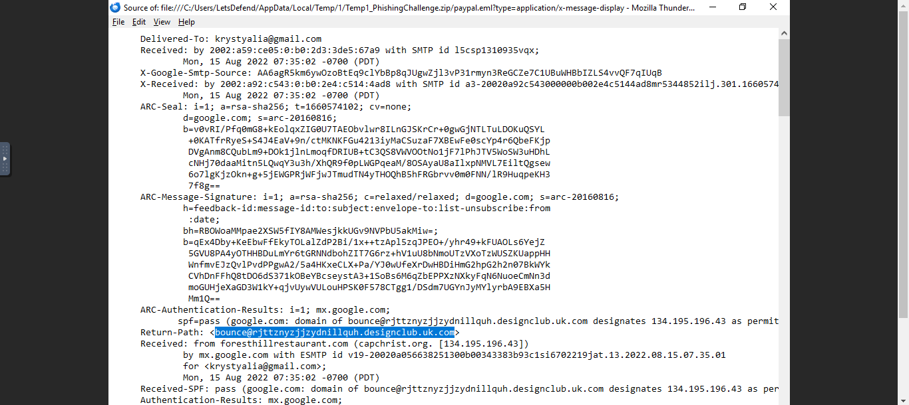
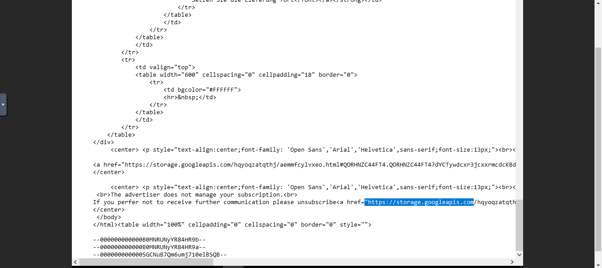
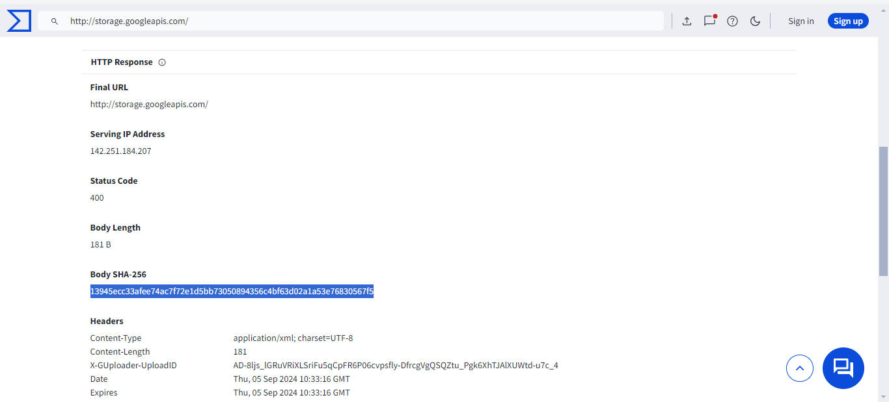

# Phishing Email Analysis — LETSDEFEND.IO

## Overview
This project focuses on analyzing a suspicious email that was received as part of a phishing email challenge from LETSDEFEND.IO. The email appeared to be from PayPal and was written in German, which raised suspicions. The goal was to thoroughly analyze the email, identify potential threats, and answer key questions about the phishing attempt.

## Objectives
1. **Analyze the suspicious email:** Investigate the email headers, content, and associated URLs to determine if the email is malicious.
2. **Answer specific questions:** Provide detailed answers to the challenge questions, such as identifying the return path, domain name, and SHA-256 hash.
3. **Document the analysis process:** Create a comprehensive report detailing the steps taken during the analysis.
4. **Showcase findings:** Present the findings and provide insights into how phishing emails can be detected and mitigated.

## Lab Environment
- **Platform:** LETSDEFEND.IO Cloud Instance
- **Operating System:** Windows
- **Tools Used:**
  - Email header analysis tools (e.g., built-in tools in the email client)
  - VirusTotal for domain scanning and hash generation

## Analysis Process

### 1. **Extracting Email Information**
   - **Return Path:** `bounce@rjttznyzjjzydnillquh.designclub.uk.com`
     - This indicates that the email was sent from a suspicious domain.
     - **Screenshot:**  
       

### 2. **Identifying the Domain in the Email**
   - **Domain Name:** `storage.googleapis.com`
   - The email contained a link to a domain hosted on Google Cloud, which can be misused by attackers.
   - **Screenshot:**  
       

### 3. **Determining if the Domain is Suspicious**
   - **Is the Domain Suspicious?** Yes
   - Although `storage.googleapis.com` is a legitimate service, in this context, it was used for hosting phishing content.
   

### 4. **Finding the Body SHA-256 Hash**
   - **SHA-256 Hash:** `13945ecc33afee74ac7f72e1d5bb73050894356c4bf63d02a1a53e76830567f5`
   - This hash was obtained by scanning the domain on VirusTotal and checking the "Details" tab.
   - **Screenshot:**  
       

### 5. **Concluding the Analysis**
   - **Is this a Phishing Email?** Yes
   - The email exhibited multiple characteristics of phishing, including a suspicious return path, misleading content, and a link to a potentially malicious domain.

## Screenshots
Screenshots documenting the analysis process are located in the `Screenshots/` folder. These images provide visual proof of the steps taken and the results obtained during the investigation.

## How to Use This Repository
1. **Explore the Documentation:** Check the `Documentation/` folder for the full analysis report.
2. **Check the Screenshots:** Visual documentation of the process is available in the `Screenshots/` folder.

## Conclusion
This project demonstrates the importance of thorough email analysis in detecting and mitigating phishing attempts. By carefully examining email headers, domains, and content, security professionals can protect users from falling victim to scams.

